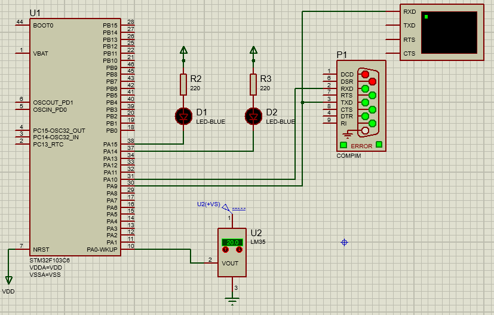
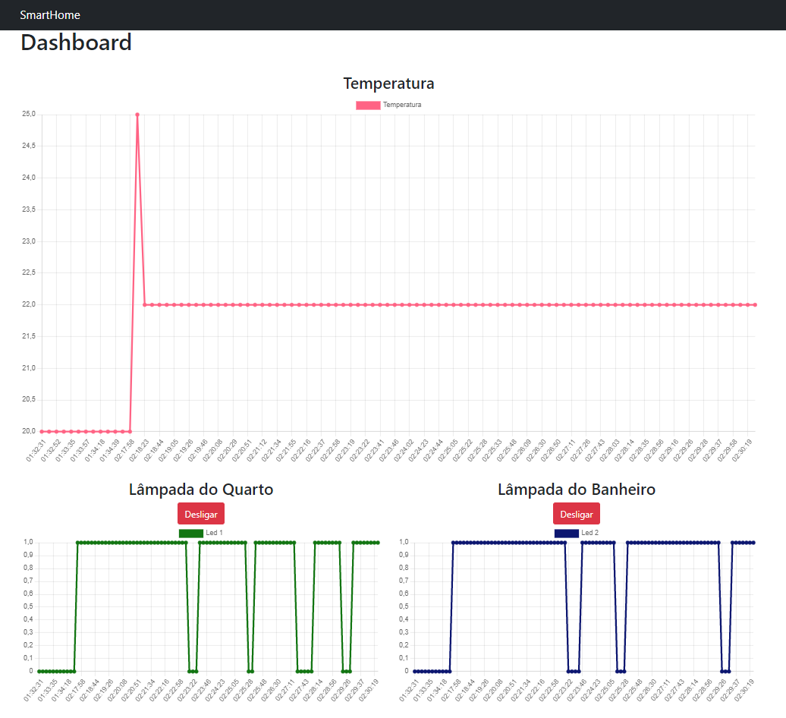

# Sistemas MicroProcessados - 2021.2 - Projeto Final: Smart Home
> Como projeto final da disciplina Sistemas Microprocessados, ministrada pelo professor Ricardo Jardel Nunes da Silveira, foi proposto um sistema capaz de enviar informações do ambiente e também controlar equipamentos de maneira remota, trazendo o conceito de casa e ambiente inteligente.

## 👨‍🏫 Integrantes da Equipe:
 - Danilo Palheta Meireles - 500863
 - Helano Fontenele Alexandrino - 
 - Matheus Rocha Monteiro - 494577
 - Vitor Rosa Evangelista - 494132

## 📹 Link para a apresentação: (YOUTUBE)

## 💻 Pré-requisitos

Para rodar todos os componentes, são necessárias as seguintes ferramentas:

* Proteus 8.12
* STM32CubeIDE
* Node.js
* Mongo DB
* PuTTY
* com0com (bind entre COM100 e COM101)

## 👩‍💻 Simulador 

Dentro do software Proteus, foi utilizado o microcontrolador STM32F103C6, recebendo sinais de um sensor de temperatura analógico LM35 e controlando duas portas GPIO (PA15 e PA14) que são utilizadas para alimentar dois leds, que podem representar relés em uma aplicação real. Por fim, toda a comunicação é feita através da portal Serial, utilizando o protocolo UART. No computador, as informações são recebidas e enviadas utilizando a porta COM101. 

## 📲 Dashboard 

Para o desenvolvimento da dashboard, foi necessária a criação de um servidor capaz de ler e escrever na porta serial em que o microcontrolador está conectado. Foi utilizada a plataforma Node.js aliado à biblioteca Express (utilizada para a criação dos enpoints acessíveis via requisições HTTP) e um banco de dados não relacional Mongo DB (responsável por guardar todas as informações coletadas pelo sensor e o estado das lampâdas no tempo da leitura).
Por fim, foi desenvolvido também uma tela utilizado a biblioteca React.js. A interface é capaz de receber e atualizar as informações dos sensores em tempo real e também enviar comandos de ligar ou desligar algum dos leds conectados.

   

